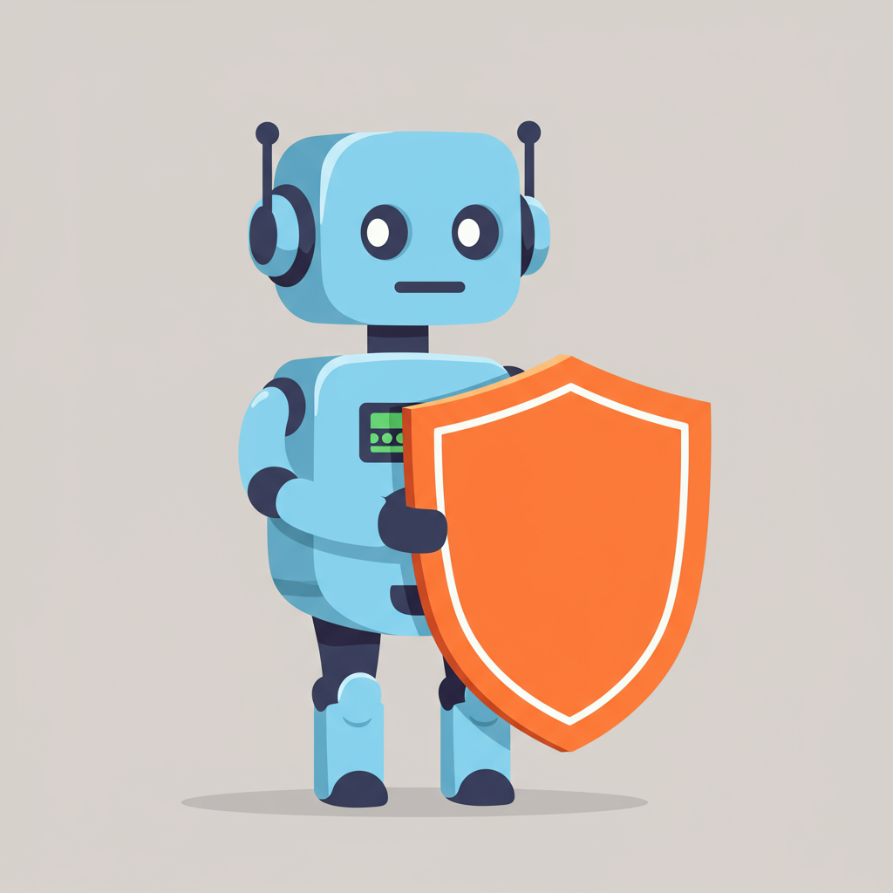

# Botbuster


**Botbuster** is a lightweight JavaScript/TypeScript library designed to detect non-human behavior in browser environments. It helps determine whether a real user, a bot, or someone behind a virtual machine is interacting with your application.

This enables developers to make informed decisions about what services, permissions, or resources should be exposed — enhancing security, privacy, and resource efficiency.

## TL;DR

```ts
import Botbuster from 'botbuster';

Botbuster.on((reason, event) => {
  console.warn('Abnormal behavior detected:', reason, event);
});
```


## Features

- Detect linear or overly perfect mouse movements
- Detect clicks on edges of elements
- Detect clicks when the mouse is not hovering over the target
- Detect jumps in mouse movement (missing intermediate events)
- Detect fake or virtualized WebGL/camera/microphone metadata
- Detects if the user leaves the browser tab or window
- Analyze WebGL vendor strings and media device information
- Multi-mode API: callback, promise, observable

## Installation

### Using npm

```bash
npm install botbuster
```

### Using yarn

```bash
yarn add botbuster
```

### Using pnpm

```bash
pnpm add botbuster
```

### Using ES Module CDN (e.g. Skypack, JSPM)

```html
<script type="module">
  import Botbuster from 'https://cdn.skypack.dev/botbuster';
  Botbuster.then(({ start }) => start());
</script>
```

## Usage

### Callback

```ts
import Botbuster from 'botbuster';

Botbuster.on((reason, event) => {
  console.warn('Abnormal behavior:', reason, event);
});
```

### Promise

```ts
import Botbuster from 'botbuster';

Botbuster.then(() => {
  console.log('Botbuster is running...');
}).catch(err => {
  console.error('Botbuster failed to start:', err);
});
```

### Observable

```ts
import Botbuster from 'botbuster';

const unsubscribe = Botbuster.listen((reason, event) => {
  console.log('Anomaly detected', reason);
});

// Stop listening later if needed
unsubscribe();
```

## Detectors

Botbuster includes the following behavioral and environmental detectors:

| Detector               | Description                                               |
|------------------------|-----------------------------------------------------------|
| MouseLinearityDetector | Detects mouse paths that are too straight or uniform      |
| MouseJumpDetector      | Detects large jumps in cursor position without events     |
| MouseIntervalDetector  | Detects lack of movement in expected time intervals       |
| ClickEdgeDetector      | Detects clicks near the edge of elements                  |
| ClickOutsideDetector   | Detects clicks outside of visible target bounds           |
| ClickDurationDetector  | Detects clicks that occur too fast to be human            |
| HardwareDetector       | Analyzes WebGL, camera, and microphone vendor metadata    |
| TabVisibilityDetector  | Detects if the user leaves the browser tab or window      |


## Creating Custom Detectors

Botbuster allows you to extend its capabilities by writing your own detectors. A detector is a class that implements the `start()` and `stop()` methods, and uses a shared `Reporter` instance to notify anomalies.

### Minimal Detector Example

```ts
import { Detector } from 'botbuster';
import type Reporter from 'botbuster/dist/core/Reporter';

export default class MyCustomDetector extends Detector {
  constructor(reporter: Reporter) {
    super(reporter);
  }

  start() {
    // Example: detect if user is idle for 10 seconds
    this.timeout = setTimeout(() => {
      this.reporter.notify('User appears idle for too long', null);
    }, 10000);
  }

  stop() {
    clearTimeout(this.timeout);
  }
}
```

### Registering Your Detector
You can use the `.use()` method to inject custom detectors before starting Botbuster:


```ts
import Botbuster from 'botbuster';
import MyCustomDetector from './MyCustomDetector';

Botbuster.use(MyCustomDetector);

Botbuster.on((reason, event) => {
  console.log('[Botbuster]', reason);
});
```

### Notes
Custom detectors receive the same `Reporter` instance used by internal detectors.

* Your detectors can listen to DOM events, timers, or Web APIs freely. 
* Detectors are started automatically once `Botbuster.start()` is called. 
* For advanced needs, you can subclass Detector and implement shared state or configuration logic.


## Browser Compatibility
BotBuster is designed to work in modern browsers:

| Browser | Min Version |
|---------|-------------|
| Chrome  | 33          |
| Firefox | 18          |
| Safari  | 7.1         |
| Edge    | 12          |
| Opera   | 20          |

### Compatibility per API

| Feature                    | Chrome | Firefox | Safari | Edge | Opera | Notes            |
| -------------------------- | ------ | ------- | ------ | ---- | ----- | ---------------- |
| `document.visibilityState` | 33     | 18      | 7.1    | 12   | 20    | Broad support    |
| `visibilitychange` event   | 33     | 18      | 7.1    | 12   | 20    | Same             |
| `window.blur/focus`        | 1      | 1       | 1      | 12   | 15    | Very old support |
| `document.activeElement`   | 1      | 1       | 1      | 12   | 15    | Very old support |


> ***Note:** Full feature support may vary depending on the detector used and API availability in each browser.*

## Philosophy

"Not all users are equal — some are bots, some are virtual, and some are real people."

Botbuster is not intended to block users but rather to understand the nature of user interaction. This allows your application to make responsible decisions regarding access, security checks, or adaptive content delivery.

## Ethics and Legal Use

Botbuster is intended solely for security research, user behavior analysis, and responsible feature adaptation.

This library does not collect, store, or transmit any personal data. It operates entirely on the client-side and serves as a heuristic tool to detect abnormal interaction patterns.

You must ensure that your use of this library complies with:

- All applicable privacy laws (e.g., GDPR, CCPA)
- The terms of service of any platform where you deploy it
- Responsible disclosure policies and ethical software practices

We discourage using Botbuster for invasive tracking or discriminatory gating. Its purpose is preventive and adaptive, not punitive.

See also: [CODE_OF_CONDUCT.md](./CODE_OF_CONDUCT.md) and [PRIVACY_NOTICE.md](./PRIVACY_NOTICE.md)

## Development

To build and test the library locally:

```bash
git clone https://github.com/olaferlandsen/botbuster
cd botbuster
npm install
npm run build
npm run test
```

## Roadmap

- Modular plugin-based detectors
- Real-time behavioral streaming support
- Integration for React, Vue, and Web Components

## License

MIT © [olaferlandsen](https://github.com/olaferlandsen)
